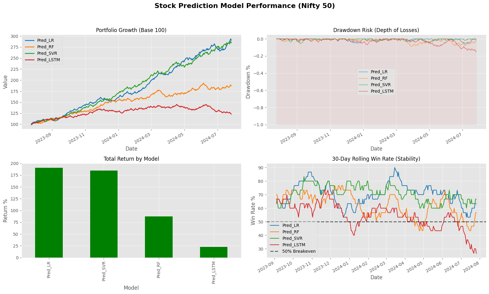
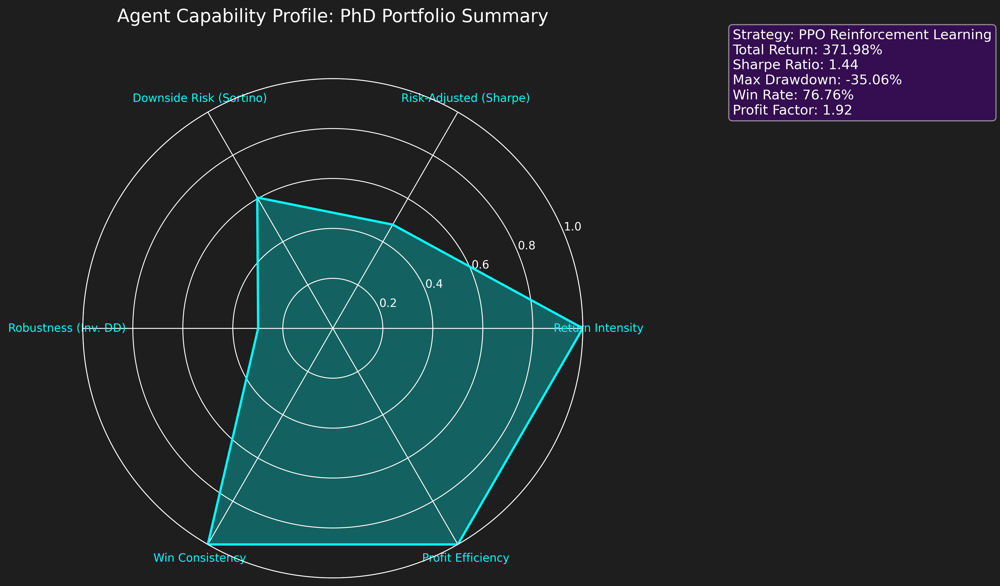

# 👨‍💻 Iniyan Andrews Joseph
### AI Researcher | Financial ML & Multimodal Agents
👨‍💻 I’m a developer exploring how AI can automate complex, creative, and decision-intensive workflows — from 📈 quantitative trading systems and 🎮 game environments to 💬 conversational agents.

My work sits at the intersection of Machine Learning and Complex Systems, with particular emphasis on Reinforcement Learning for autonomous decision-making and Multimodal LLMs for interactive systems. I build projects from scratch and iterate aggressively, combining theoretical rigor, interpretability, and systems-level thinking to move beyond black-box models toward robust, deployable intelligence.

---

## 🎯 Research

### 📈 [HOPE - Probabilistic Stock Screening System](https://github.com/Joeytribb/HOPE)
> **Question**: Can simple linear models outperform Deep Learning in short-term volatility prediction?

A comparative analysis of ML architectures for predicting short-term alpha in high-volatility markets.
*   **Key Finding**: Linear Regression **outperformed LSTM and Random Forest** by achieving a **70% Win Rate** and **190% Return** in backtests, demonstrating that model simplicity often generalizes better in stochastic financial environments.
*   **Tech Stack**: `scikit-learn`, `pandas`, `Linear Regression`, `LSTM`.
*   

### 🧠 [Bithax - Deep RL High-Frequency Trading](https://github.com/Joeytribb/bithax)
> **System**: PPO-based autonomous agent for Bitcoin HFT with 0.05% fee constraints.

📈 End-to-End Continuous Control RL Agent — Bitcoin (1H)

An end-to-end continuous control trading agent trained on 1-hour Bitcoin OHLCV data, designed to learn regime-sensitive allocation strategies rather than naive directional bets.

Architecture
Proximal Policy Optimization (PPO) with separate actor (policy) and critic (value) heads for stable policy gradients and reduced variance in value estimation.

Innovation

Reward shaping that explicitly penalizes drawdowns to control tail risk.

Transaction costs integrated directly into the value function to discourage overtrading.

Continuous action space enabling dynamic position sizing rather than binary long/flat decisions.

Performance (Backtest: ~2.5 years)

Total Return: 371%

Sharpe Ratio: 1.44

Win Rate: 76%

Demonstrated regime awareness by remaining inactive during low-confidence volatility and scaling exposure during high-conviction trends.

Tech Stack
PyTorch · Stable-Baselines3 · Gymnasium · Pandas
*   

### 👁️ [Jaguu - Multimodal LLM Assistant](https://github.com/Joeytribb/Jaguu)
> **Agent**: Voice-and-Vision capable AI assistant running locally.

An attempt to build a privacy-first, local multimodal agent.
*   **Capabilities**: Real-time **Image Description** (via Vision LLMs) and **Voice Interaction** (Whisper + TTS).
*   **Use Case**: Accessible technology for the visually impaired.
*   **Tech Stack**: `Ollama`, `Llama-3`, `Whisper`, `Python`.

---

## 🧪 Current Experimental & Engineering Projects

*   **[TMgo - Deep-RL Autonomous Racing](https://github.com/Joeytribb/TMgo)**: Training a DQN agent to master *Trackmania Nations Forever* using raw pixel inputs and Lidar sensors. Demonstrates complex continuous control.
*   **[Indus_valley - Archeo-Vision Clustering](https://github.com/Joeytribb/Indus_valley)**: Utilizing unsupervised clustering (K-Means) to categorize and analyze ancient scripts from the Indus Valley civilization.

---

## 🛠️ Technical Arsenal

| Domain | Tools & Frameworks |
| :--- | :--- |
| **Deep Learning** | PyTorch, TensorFlow, Keras, Stable-Baselines3 |
| **Data Science** | Pandas, NumPy, Scikit-learn, Matplotlib, Plotly |
| **Systems** | Docker, Git, Linux, Arduino, C |
| **LLMs** | Ollama, Llama-3, LangChain, HuggingFace |

---

### 📬 Contact
 

